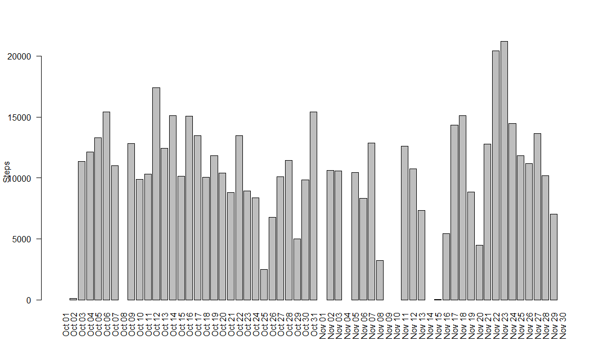
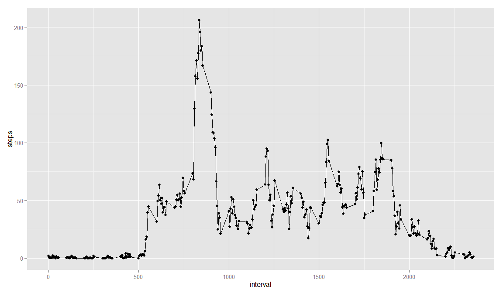
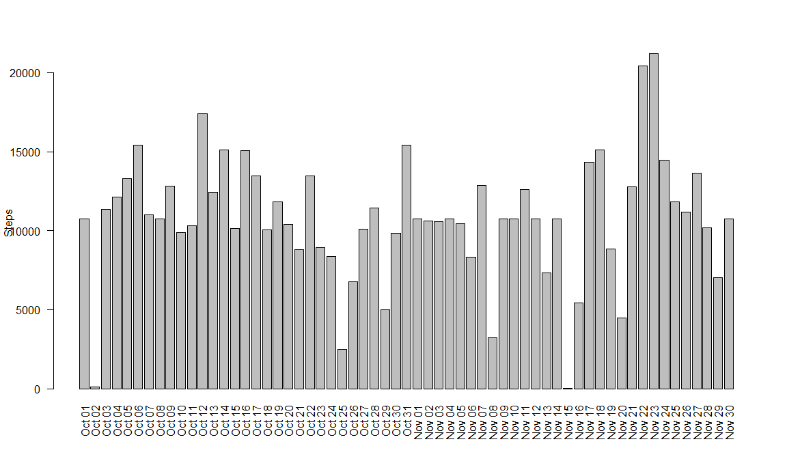
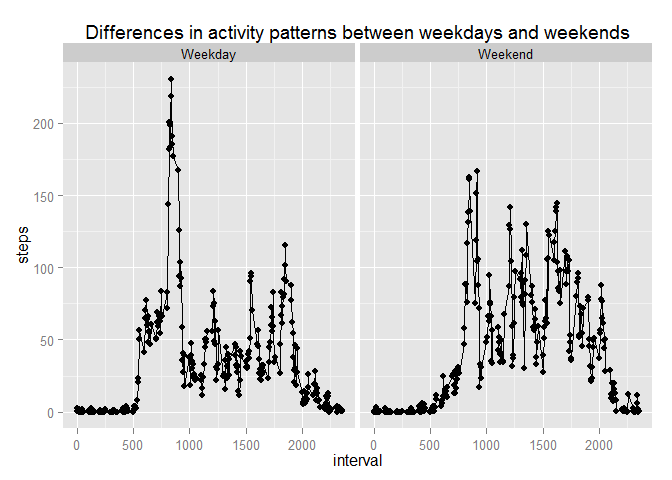

# Reproducible Research: Peer Assessment 1

## Loading and preprocessing the data

```r
require(reshape2)
```

```
## Loading required package: reshape2
```

```r
require(ggplot2)
```

```
## Loading required package: ggplot2
```

```r
# Reading data from CSV file
data <- read.csv("activity.csv")

#Summarizing data - total number of steps taken each day
meltstepsperday <- melt(data, "date", "steps")
stepsperday <- dcast(meltstepsperday, date ~ variable, sum)
```

## What is mean total number of steps taken per day?

#### Histogram of the total number of steps taken each day

```r
barplot(stepsperday$steps, names.arg=format.Date(stepsperday$date,"%b %d"), las=2, ylab="Steps")
```

 

#### Mean total number of steps taken each day

```r
#computing mean
mean(stepsperday$steps, na.rm=TRUE)
```

```
## [1] 10766
```

#### Median total number of steps taken each day

```r
#computing median
median(stepsperday$steps, na.rm=TRUE)
```

```
## [1] 10765
```

## What is the average daily activity pattern?

#### Time series plot of the 5-minute interval (x-axis) and the average number of steps taken, averaged across all days (y-axis)

```r
#computing average steps per interval across all days
meltstepsperinterval <- melt(data, "interval", "steps")
stepsperinterval <- dcast(meltstepsperinterval, interval ~ variable, mean, na.rm=TRUE)

#Ploting the data
gplot <- ggplot(stepsperinterval, aes(interval, steps))
gplot + geom_point() + geom_line()
```

 

#### 5-minute interval, on average across all the days in the dataset, contains the maximum number of steps

```r
stepsperinterval[stepsperinterval$steps==max(stepsperinterval$steps),]
```

```
##     interval steps
## 104      835 206.2
```

## Imputing missing values

#### Total number of missing values in the dataset (i.e. the total number of rows with NAs)

```r
nrow(data[is.na(data$steps),])
```

```
## [1] 2304
```

#### Strategy for filling in all of the missing values in the dataset
The strategy is filling in all the missing values in the dataset with the average number of steps per interval, averaged across all the days.

<b>For example:</b>

<p><i>
If average number of steps for interval "5" across all the days is : 0.33, then 0.33 will replace all NAs across all the records where internval is "5" and steps is "NA".
</i></p>

#### Creating a new dataset that is equal to the original dataset but with the missing data filled in.

```r
NoNAData <- data
missingdata <- is.na(data$steps)
NoNAData[missingdata, "steps"]<-stepsperinterval[as.factor(data[missingdata, "interval"]), "steps"]
```

#### Histogram of the total number of steps taken each day with the missing data filled in.

```r
NoNAtepsperday <- aggregate(steps ~ date, NoNAData, sum)
barplot(NoNAtepsperday$steps, names.arg=format.Date(NoNAtepsperday$date,"%b %d"), las=2, ylab="Steps")
```

 

#### Mean total number of steps taken each day with the missing data filled in.

```r
#computing mean
mean(NoNAtepsperday$steps)
```

```
## [1] 10766
```

#### Median total number of steps taken each day with the missing data filled in.

```r
#computing median
median(NoNAtepsperday$steps)
```

```
## [1] 10766
```

## Are there differences in activity patterns between weekdays and weekends?

#### Creating a new factor variable in the dataset with two levels - "weekday" and "weekend" indicating whether a given date is a weekday or weekend day

```r
NoNAData$day <- weekdays(as.Date(NoNAData$date, format="%Y-%m-%d")) 
NoNAData[NoNAData$day=="Sunday" | NoNAData$day=="Saturday", "day"] <- "Weekend" 
NoNAData[NoNAData$day!="Weekend", "day"] <- "Weekday" 
```

#### Panel plot containing a time series plot of the 5-minute interval (x-axis) and the average number of steps taken, averaged across all weekday days or weekend days (y-axis)

```r
meltedData <- melt(NoNAData, c("day","interval"), "steps")
castedData <- dcast(meltedData, day + interval ~ variable, mean)
g <- ggplot(castedData, aes(interval, steps))
g + geom_point() + geom_line() + facet_grid(. ~ day) + ggtitle("Differences in activity patterns between weekdays and weekends")
```

 
